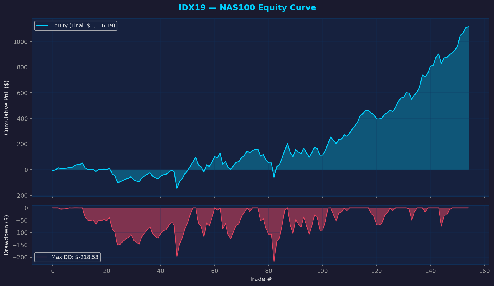
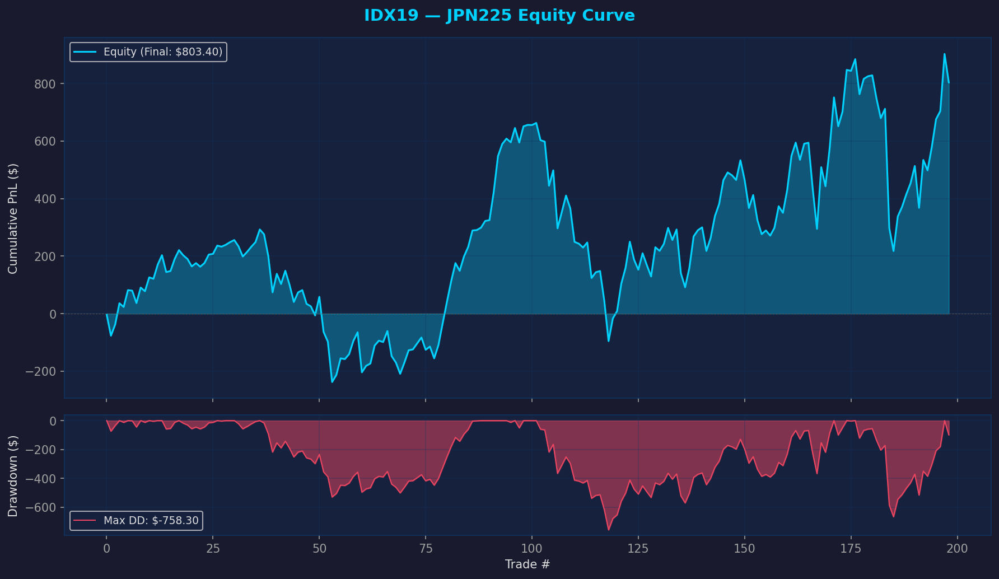
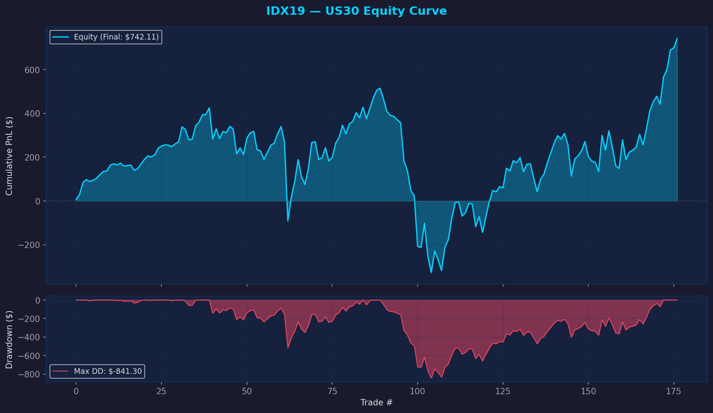

# IDX19 Equity Curve Analysis

**Report Date:** 2026-02-12  
**Generated Charts:** `scratchpad/IDX19_equity_curves/`

---

## Aggregate Portfolio (10 Symbols)

### Key Metrics
- **Final Equity:** **$3,570.15**
- **Max Drawdown:** **-$2,121.76**
- **Longest Flat Period:** **639 trades**
- **Total Trades:** 1,797

---

## Stop Loss Validation

**Directive:** Check for `Stop_Loss_2ATR` exits.  
**Result:** **0** (Zero) stop loss exits found across all symbols.

> [!NOTE]
> All trades exited via Price Exit (Close > HH_prev) or Time Exit (5 bars). The 2×ATR stop loss was never triggered.

---

## Top Performers

### 1. NAS100 ($1,116)

### 2. JPN225 ($803)

### 3. US30 ($742)

---

## Complete Symbol Metrics

| Symbol | Final Equity | Max Drawdown | Trades | Longest Flat (Trades) |
|:---|---:|---:|---:|---:|
| **NAS100** | $1,116.19 | -$218.53 | 155 | 41 |
| **JPN225** | $803.40 | -$758.30 | 199 | 70 |
| **US30** | $742.11 | -$841.30 | 177 | 83 |
| **AUS200** | $283.97 | -$120.95 | 201 | 60 |
| **UK100** | $247.70 | -$124.60 | 203 | 90 |
| **SPX500** | $223.88 | -$105.00 | 173 | 47 |
| **ESP35** | $194.99 | -$319.61 | 218 | 179 |
| **EUSTX50** | $145.99 | -$129.40 | 196 | 77 |
| **FRA40** | $45.10 | -$247.34 | 210 | 170 |
| **GER40** | -$233.18 | -$257.49 | 65 | 52 |

---

## Conclusion
The equity curve confirms the strategy's profile: steady growth driven by a few major indices (NAS100, JPN225, US30), with significant flat periods and drawdowns in weaker symbols (GER40, FRA40). **The stop loss component remains inactive.**
