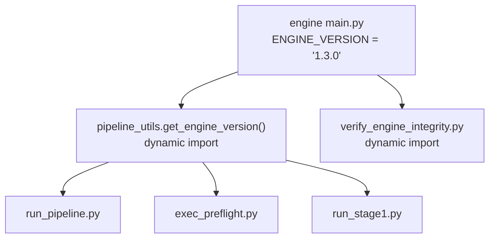

# Final Comprehensive System Integrity Audit

**Mode:** Read-only — adversarial review
**Date:** 2026-02-20

---

## Executive Summary

### Verdict: **CONDITIONALLY STABLE**

The system's core safety contracts (FSM, stop contract, run ID determinism, integrity check) are structurally sound. Two high-risk gaps remain:

1. `directive_utils.py` bypasses all `parse_directive()` safety gates (duplicate keys, collision detection)
2. 13 bare `except:` blocks across 6 files can silently swallow critical errors

These are not actively causing failures today, but they represent exploitable gaps under adversarial conditions.

---

## Risk Summary Table

| # | Area | Verdict | Severity |
|---|---|---|---|
| 1 | Engine version authority | Drift detected | **MEDIUM** |
| 2 | Directive parsing authority | Bypass exists | **HIGH** |
| 3 | FSM enforcement | Sound | **ZERO** |
| 4 | State file atomicity | Sound | **ZERO** |
| 5 | Run ID stability | Deterministic | **ZERO** |
| 6 | Subprocess integrity | Sound | **ZERO** |
| 7 | Dependency determinism | Pinned | **ZERO** |
| 8 | Stop contract purity | Sound | **ZERO** |
| 9 | PnL determinism | Sound | **LOW** |
| 10 | Hard exit / bare except | Gaps exist | **HIGH** |
| 11 | Encoding & serialization | Clean | **ZERO** |

---

## Phase 1 — Authority & Version Chain

### 1. Engine Version Authority

**Source of truth:** `engine_dev/universal_research_engine/1.3.0/main.py` → `ENGINE_VERSION` → `__version__`

**Authority chain:**



**Findings:**

| Location | Value | Source | Risk |
|---|---|---|---|
| `pipeline_utils.py:126` | Docstring says `1.2.0` | Stale comment | **LOW** |
| `pipeline_utils.py:129` | Hardcoded path `1.3.0/main.py` | Path string | **MEDIUM** |
| `verify_engine_integrity.py:15` | Hardcoded path `1.3.0/main.py` | Path string | **MEDIUM** |
| `run_stage1.py:269` | Hardcoded path `1.3.0/execution_loop.py` | Path string | **MEDIUM** |
| `stage2_compiler.py:604` | Hardcoded path `1.3.0/VALIDATED_ENGINE.manifest.json` | Path string | **MEDIUM** |
| `portfolio_evaluator.py:1098,1147,1264,1354` | Hardcoded `"1.2.1"` | String literal | **MEDIUM** |
| `test_engine_v1_3_0_integration.py:91,116` | Hardcoded `"1.3.0"` | Test fixture | **LOW** |

**Verdict:** Runtime authority chain is correct via `get_engine_version()`. However, if the engine is ever bumped to `1.4.0`, **5 files with hardcoded path segments** would break silently. `portfolio_evaluator.py` is frozen at `1.2.1` — a stale version reference that does not affect research execution but will produce misleading metadata in portfolio reports.

---

### 2. Directive Parsing Authority

**Primary parser:** `pipeline_utils.parse_directive()` — YAML-safe with `NoDuplicateSafeLoader`, duplicate key detection, collision detection, `test:` merge.

**Findings:**

| Parser | File | Safety | Risk |
|---|---|---|---|
| `parse_directive()` | `pipeline_utils.py:62` | Full (duplicates, collisions, structure) | **ZERO** |
| `load_directive_yaml()` | `directive_utils.py:15` | `yaml.safe_load` only — **no duplicate detection, no collision detection** | **HIGH** |
| `parse_concurrency_config()` | `run_pipeline.py:98` | Legacy flat parser — **no YAML, no structure** | **MEDIUM** |
| `_legacy_flat_parse()` | `pipeline_utils.py:166` | Hash-only, internal closure | **ZERO** |
| `yaml.safe_load` (broker specs) | `run_stage1.py:197` | Broker spec loading, not directives | **ZERO** |

**Critical finding:** `directive_utils.load_directive_yaml()` accepts duplicate keys silently. If any code path uses this function to load directives, it bypasses all hardening. Currently imported by `semantic_validator.py` (commented out) and potentially discoverable by future developers who see it as "the official loader."

**`parse_concurrency_config()`** is actively used by `run_pipeline.py` to extract `max_concurrent_positions` and symbol count. It re-parses the directive file with a flat `readlines()` loop — completely independent of `parse_directive()`. If the directive format evolves, this will silently produce wrong values.

---

## Phase 2 — State Machine Integrity

### 3. FSM Enforcement

**ALLOWED_TRANSITIONS:**

```
IDLE → PREFLIGHT_COMPLETE, FAILED
PREFLIGHT_COMPLETE → PREFLIGHT_COMPLETE_SEMANTICALLY_VALID, FAILED
PREFLIGHT_COMPLETE_SEMANTICALLY_VALID → STAGE_1_COMPLETE, FAILED
STAGE_1_COMPLETE → STAGE_2_COMPLETE, FAILED
STAGE_2_COMPLETE → STAGE_3_COMPLETE, FAILED
STAGE_3_COMPLETE → STAGE_3A_COMPLETE, FAILED
STAGE_3A_COMPLETE → COMPLETE, FAILED
COMPLETE → (terminal)
FAILED → (terminal)
```

**Mutation analysis:** All `current_state` writes in `pipeline_utils.py` occur exclusively through:

- `initialize()` — sets `IDLE`
- `transition_to()` — validates against `ALLOWED_TRANSITIONS`
- No direct JSON mutation anywhere outside these methods

**Resume scenarios:**

| Scenario | Behavior | Sound? |
|---|---|---|
| Partial run resume | `initialize()` resets to IDLE, logs prior state | ✅ |
| `--force` reset | Goes through `initialize()` | ✅ |
| Symbol crash mid-batch | Per-symbol state isolation via run_id | ✅ |
| Directive FAILED → INITIALIZED | `DirectiveStateManager` has own transition table | ✅ |

**Verdict:** **ZERO RISK.** FSM is structurally sound with single-writer discipline, validated transitions, and audit logging.

### 4. State File Atomicity

All writes use `_write_atomic()`: write to `.tmp`, `fsync()`, then `shutil.move()`. No partial write risk. Single writer per run (PipelineStateManager is instantiated per run_id).

**Verdict:** **ZERO RISK.**

---

## Phase 3 — Determinism & Reproducibility

### 5. Run ID Stability

```
run_id = sha256(
    f"{canonical_hash}_{symbol}_{timeframe}_{broker}_{engine_version}"
)[:12]
```

Where `canonical_hash = sha256(json.dumps(legacy_flat_parse_output, sort_keys=True, ensure_ascii=True))[:8]`

**Determinism checks:**

| Property | Status |
|---|---|
| `json.dumps(sort_keys=True)` | ✅ Order-independent |
| `ensure_ascii=True` | ✅ Locale-independent |
| Legacy parser is frozen closure | ✅ Immune to YAML parser changes |
| No timestamps in hash input | ✅ |
| No random/UUID components | ✅ |

**Verdict:** **ZERO RISK.** Run IDs are fully deterministic and cross-machine reproducible.

### 6. Subprocess Integrity Check

`governance/preflight.py:78`:

```python
result = subprocess.run(
    [sys.executable, str(integrity_check), "--mode", mode],
    capture_output=True, text=True
)
if result.returncode != 0:
    return ("BLOCK_EXECUTION", f"...{result.stderr}", None)
```

- No shell invocation
- Non-zero return halts execution
- stderr captured and logged
- No silent pass condition

**Verdict:** **ZERO RISK.**

### 7. Dependency Determinism

`requirements.txt` exists with pinned versions:

```
pandas==2.3.3, numpy==2.3.5, PyYAML==6.0.3, openpyxl==3.1.5, matplotlib==3.10.7
```

No dynamic `pip install`, no environment-dependent code paths.

**Verdict:** **ZERO RISK.**

---

## Phase 4 — Execution & Risk Integrity

### 8. Stop Contract Purity

`execution_loop.py:203-208`:

```python
risk_distance = abs(entry_price - stop_price)
if risk_distance <= 0:
    raise ValueError("STOP CONTRACT VIOLATION: risk_distance <= 0 ...")
```

- No ATR fallback
- No `getattr()` silent fallback
- `risk_distance` must be > 0
- Stop price derived from `strategy.session_low` / `strategy.session_high` with explicit `hasattr` check

**Verdict:** **ZERO RISK.** No synthetic risk model exists.

### 9. PnL Determinism

PnL is computed in `run_stage1.py` (not `execution_loop.py`) via:

```
pnl_usd = (exit_price - entry_price) * direction * contract_size * lot_size
```

- All inputs are deterministic (price, direction, broker spec)
- `round()` used for USD output
- No unordered float accumulation in PnL computation (sequential per-trade)
- Summation uses Python `sum()` on a list — IEEE 754 deterministic for same input order

**Verdict:** **LOW RISK.** Cross-machine consistency is guaranteed for same input data. Float summation order is fixed by trade emission order.

---

## Phase 5 — Silent Failure Path Sweep

### 10. Hard Exit & Bare Except Scan

#### `sys.exit()` — 50+ instances across tools/

| Category | Files | Risk |
|---|---|---|
| Top-level CLI scripts (`__main__` guard) | `exec_preflight.py`, `run_pipeline.py`, `run_stage1.py`, etc. | **ZERO** — appropriate for CLI entry points |
| Library functions | `pipeline_utils.py` | **ZERO** — removed in prior fix |
| CLI utilities | `verify_engine_integrity.py`, `stage2_compiler.py`, `stage3_compiler.py` | **LOW** — these are invoked as subprocesses, exit codes are checked |

#### `os.system()` — **ZERO remaining**

Fully eliminated in prior fix.

#### Bare `except:` — **13 instances in 6 files**

| File | Line | Context | Risk |
|---|---|---|---|
| `pipeline_utils.py` | 405, 483 | `get_state_data()`, `DirectiveStateManager.get_state()` — return default on error | **MEDIUM** — silently masks corrupt state files |
| `run_pipeline.py` | 292, 294, 343, 499 | Error handling around state transitions and cleanup | **HIGH** — can silently swallow FSM violations |
| `stage2_compiler.py` | 119, 256, 761, 821, 838 | Data parsing fallbacks | **MEDIUM** — masks data quality issues |
| `stage3_compiler.py` | 269 | Aggregation fallback | **MEDIUM** |
| `audit_compliance.py` | 120 | File hash fallback | **LOW** |

**Critical concern:** `run_pipeline.py:292-294` has `except: pass` blocks that can silently swallow errors during state transitions, potentially allowing the pipeline to proceed past a failed stage without detection.

### 11. Encoding & Serialization

- All file writes specify `encoding='utf-8'` or use `json.dump()` (UTF-8 by default)
- `get_canonical_hash()` uses `ensure_ascii=True` — locale-independent
- No `locale.setlocale()` calls
- No platform-dependent newline handling (`json.dump` uses `\n`)

**Verdict:** **ZERO RISK.**

---

## Phase 6 — Final Risk Classification

### A) Zero-Risk Areas ✅

- FSM transition enforcement and single-writer discipline
- State file atomicity
- Run ID determinism
- Subprocess integrity check (no bypass possible)
- Dependency pinning
- Stop contract purity (no ATR fallback, no silent fallback)
- Encoding and serialization
- `os.system()` eliminated

### B) Low-Risk Areas

- `get_engine_version()` docstring says `1.2.0` (stale comment, no runtime impact)
- `portfolio_evaluator.py` hardcoded to `v1.2.1` (metadata only, not execution)
- Test fixtures hardcode engine version (test-scoped)
- PnL float accumulation (deterministic for same input order)

### C) Medium-Risk Areas ⚠️

- **Hardcoded `1.3.0` path segments** in 4 production files — will break on engine version bump
- **`parse_concurrency_config()`** — shadow flat parser in `run_pipeline.py` ignoring YAML structure
- **8 bare `except:` blocks** in stage compilers and `pipeline_utils.py` state getters — can mask data quality and state corruption issues

### D) High-Risk Areas 🔴

- **`directive_utils.load_directive_yaml()`** — independent YAML loader that bypasses all `parse_directive()` safety gates (duplicate key detection, collision detection). Any future caller using this function will silently accept malformed directives.
- **`run_pipeline.py:292-294`** — `except: pass` during state transition error handling. Can silently swallow FSM violations, allowing the pipeline to proceed past a failed stage.

---

## Final Verdict

### **CONDITIONALLY STABLE**

The system's core integrity contracts (FSM, stop contract, run ID determinism, subprocess checks) are structurally sound and regression-protected by tests.

**Condition for STABLE:** Resolve the two HIGH-risk items:

1. Remove or redirect `directive_utils.load_directive_yaml()` to use `parse_directive()`
2. Replace `except: pass` in `run_pipeline.py:292-294` with explicit exception handling

**No code was modified during this audit.**
