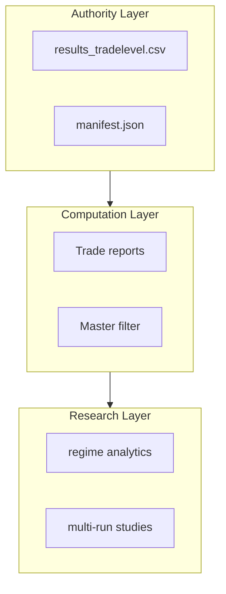
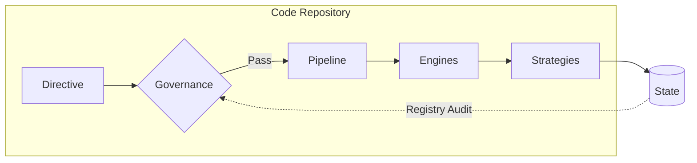

# TradeScan System Surface Architecture Map

## Architecture Scope
This document defines the structural architecture of the Trade_Scan platform. It provides a mapping of repository layers, governance gates, and execution components. It does not describe specific strategy logic, indicator implementations, or research methodology.

---

This document serves as the authoritative top-level architectural map for the Trade_Scan research platform. It defines the system layers, repository structure, and the operational boundaries between source code and runtime state.

---

## SECTION 1 — System Layer Overview

The platform is organized into seven distinct architectural layers, each with a strict responsibility boundary.

| Layer | Purpose | Primary Folders | Key Components |
| :--- | :--- | :--- | :--- |
| **Directive** | Research intent definition | `backtest_directives/` | YAML Directives |
| **Governance** | Safety & integrity gating | `governance/` | `preflight.py`, `semantic_validator.py` |
| **Pipeline** | Stage orchestration and execution coordination | `tools/orchestration/` | Infrastructure: `tools/orchestration/`, Entrypoint: `tools/run_pipeline.py` |
| **Engine** | Trade execution & simulation | `engines/`, `engine_dev/` | `filter_stack.py`, `execution_loop.py` |
| **Strategy** | Trading logic implementation | `strategies/` | Generated `strategy.py` files |
| **Tools** | Operational control panel | `tools/` | `run_portfolio_analysis.py`, Maintenance tools |
| **State** | Runtime artifacts & history | `TradeScan_State/` | `runs/`, `backtests/`, `registry/` |

---

## SECTION 2 — Repository Directory → Layer Mapping

The system follows a predictable mapping between the physical directory structure and the architectural layers.

| Directory | Layer | Responsibility |
| :--- | :--- | :--- |
| `tools/` | Tools | Top-level operational entry points and CLI utilities. |
| `tools/orchestration/` | Pipeline | Logic for coordinating multi-stage pipeline transitions. |
| `governance/` | Governance | Safety gates, admission controllers, and compliance checkers. |
| `engines/` | Engine | Core research engines and signal processing stacks. |
| `strategies/` | Strategy | Target directory for generated and tested trading strategies. |
| `indicators/` | Engine | Library of technical indicators used by the execution engine. |
| `outputs/` | Tools/State | Generated reports, audits, and system documentation. |
| `config/` | Pipeline/Engine | Global configuration for pathing, data roots, and thresholds. |
| `TradeScan_State/` | State | **External Root** for all non-source runtime artifacts. |

---

## SECTION 3 — Operational Entry Points

Operational entry points are the primary interfaces for system interaction.

| Entrypoint | Purpose | Primary Stages | Primary Artifacts |
| :--- | :--- | :--- | :--- |
| `run_pipeline.py` | Full directive execution | Stage 0 → Stage 3A | `results_tradelevel.csv`, `Strategy_Master_Filter.xlsx` |
| `run_portfolio_analysis.py` | Governance-grade portfolio simulation | Stage 4 | `portfolio_summary.json` |
| `format_excel_artifact.py` | Decoupled Excel styling applied to generated ledgers | Post-Pipeline Workflow | Formatted `.xlsx` artifacts |

---

## SECTION 4 — Governance Enforcement Points

Safety gates are placed at critical transition boundaries to ensure system integrity.

Gate | Layer | Protection Provided
--- | --- | ---
`preflight.py` | Stage 0 | Admission gate; ensures data availability, system readiness, and temporal baseline integrity.
`semantic_validator.py` | Stage 0.5 | AST-level guard; prevents illegal regime or engine logic access.
`strategy_dryrun_validator.py` | Stage 0.75 | Dry-Run Strategy Import Validation before execution.
`semantic_coverage_checker.py` | Stage 0.55 | Logic gate; ensures all directive parameters are used in strategy.
`verify_engine_integrity.py` | Stage 0 | Hash gate; detects unauthorized mutations in core engine code.
`FilterStack` | Engine | Bar-by-bar runtime gate; enforces strict signal/execution rules.

---

## SECTION 5 — Execution Engine Components

The engine layer ensures that bar-by-bar simulation is 100% deterministic and reproducible.

- **`engines/filter_stack.py`**: The authoritative gatekeeper for trade entry and exit signals. It enforces regime-aware execution logic.
- **`execution_loop.py`**: (Located in `engine_dev/`) The core iterator that processes historical bars and emits trade events.
- **`capital_wrapper`**: A deterministic event-based simulator that applies capital and risk constraints post-execution.
- **`portfolio_evaluator`**: Cross-instrument engine that reconciles individual symbol results into a unified portfolio view.

---

## SECTION 6 — Pipeline Execution Flow

The system operates as a sequence of governing and executing stages.

1. **Stage 0 — Preflight**: Data availability and system health checks (`preflight.py`).
2. **Stage 0.5 — Semantic Validation**: Code-level inspection of strategies (`semantic_validator.py`).
3. **Stage 0.75 — Dry Run**: Execution smoke test in a sandbox environment.
4. **Stage 1 — Execution**: Multi-symbol bar-by-bar simulation (`run_stage1.py`).
5. **Stage 2 — Reporting**: Derivation of trade-level metrics and Excel reports, preserving non-standard attributes (e.g., regime classification).
6. **Stage 3 — Aggregation**: Construction of master strategy filters as pure summaries (strictly isolated from trade-level aggregations).
7. **Stage 3A — Manifest Binding**: Generation of SHA-256 manifests to lock the run identity.
8. **Stage 4 — Portfolio Evaluation**: Portfolio-level simulation, candidate promotion, and ledger consolidation.
9. **Workflow — Artifact Formatting**: Decoupled presentation styling of output ledgers/reports via standalone orchestrator.
10. **Stage 5/6 — Capital Wrapper & Robustness**: Event-based capital modeling and stability testing.

*References*: [pipeline_authority_trace.md](file:///c:/Users/faraw/Documents/Trade_Scan/outputs/system_reports/01_system_architecture/pipeline_authority_trace.md), [pipeline_flow.md](file:///c:/Users/faraw/Documents/Trade_Scan/outputs/system_reports/01_system_architecture/pipeline_flow.md)

---

## SECTION 7 — System State Boundary

A fundamental architectural rule is the **separation of Source and State**.

- **Trade_Scan (Source)**: Contains 100% immutable source code and documentation.
- **TradeScan_State (State)**: Contains 100% mutable (or append-only) runtime artifacts.

**Typical State Artifacts (Stored Externally):**
- `runs/`: Snapshot strategies and raw execution data.
- `candidates/`: Strategies undergoing research validation.
- `sandbox/`: Temporary execution artifacts.
- `backtests/`: Historical backtest states and batch summaries.
- `logs/`: Time-series execution logs.

**Rationale**: Keeping state external ensures the repository remains lean, portable, and git-clean, while providing a clear audit trail of research history.

---

## SECTION 7A — Data Authority Hierarchy

While the system strictly separates Source and State, the State layer itself is internally structured into a strict authority hierarchy:

1. **Authority Layer (Immutable System Truth)**: Cryptographically locked run histories and primitive execution footprints. Artifacts here cannot be regenerated without re-running the engine.
   - `results_tradelevel.csv`
   - `results_risk.csv`
   - `manifest.json`
   - `run_registry.json`

2. **Computation / Reporting Layer (Deterministic Derived Artifacts)**: Human-readable aggregations, metrics, and ledgers explicitly derived from the Authority Layer. If deleted, these can be perfectly and deterministically rebuilt.
   - `AK_Trade_Report.xlsx`
   - `Strategy_Master_Filter.xlsx`
   - `Filtered_Strategies_Passed.xlsx`
   - `portfolio_summary.json`

3. **Research / Analysis Layer (Exploratory)**: Future analytical datasets including regime analytics, multi-run correlation datasets, and portfolio heatmaps built for pure data science rather than operational pipeline truth.

---

## SECTION 8 — Operational Surface Map

The system exposes specialized surfaces for different operational needs.

Surface | Interaction Point | Primary Actors
--- | --- | ---
**Human Control Surface** | `tools/` | Researchers & DevOps
**Governance Surface** | `governance/` | Auditors & Admission Gates
**Execution Surface** | `engines/` | Execution Engines
**Pipeline Surface** | `tools/orchestration/` | System Orchestrators
**Strategy Surface** | `strategies/` | Strategy Generators

These layers interact via **Directives** (Inputs) and **Registries/Manifests** (State Handshakes), ensuring no layer bypasses the governance gates.

---

## SECTION 8A — Control Flow Boundaries

The platform enforces strict control flow boundaries between architectural layers to ensure governance cannot be bypassed.

- **Directive → Pipeline**: Research intent is ingested by the orchestrator.
- **Pipeline → Governance**: The orchestrator submits artifacts to validation gates.
- **Pipeline → Engine**: Upon gate clearance, the orchestrator dispatches execution.
- **Engine → State**: Execution results and snapshots are emitted to the external state root.
- **State → Tools**: Analysis and reporting tools ingest state artifacts for evaluation.

**Governance Bound**: No execution (Engine) or reporting (Tools) may proceed without explicit validation (Governance) handshakes.

---

## SECTION 9 — Architecture Diagram

The flow of research intent to finalized state:

---

## SECTION 10 — Architectural Principles

The system is governed by five core tenets:

1. **Deterministic Execution**: The same data + same code MUST produce the same results.
2. **Immutable Run Artifacts**: Once a run is bound, its strategy code and manifests are frozen.
3. **Registry-Based Lifecycle Tracking**: All run states are tracked in authoritative central ledgers.
4. **Governance-First Pipeline Admission**: No execution occurs without preflight and semantic approval.
5. **Separation of Source and Runtime State**: Ensures repository integrity and scalable data management.
6. **Decoupled Presentation Constraints**: Computation must emit clean structuring data; dedicated styling orchestrators apply human-readable formats independently.

---
**Status**: Top-Level Authority Map | **Version**: 1.0.0
