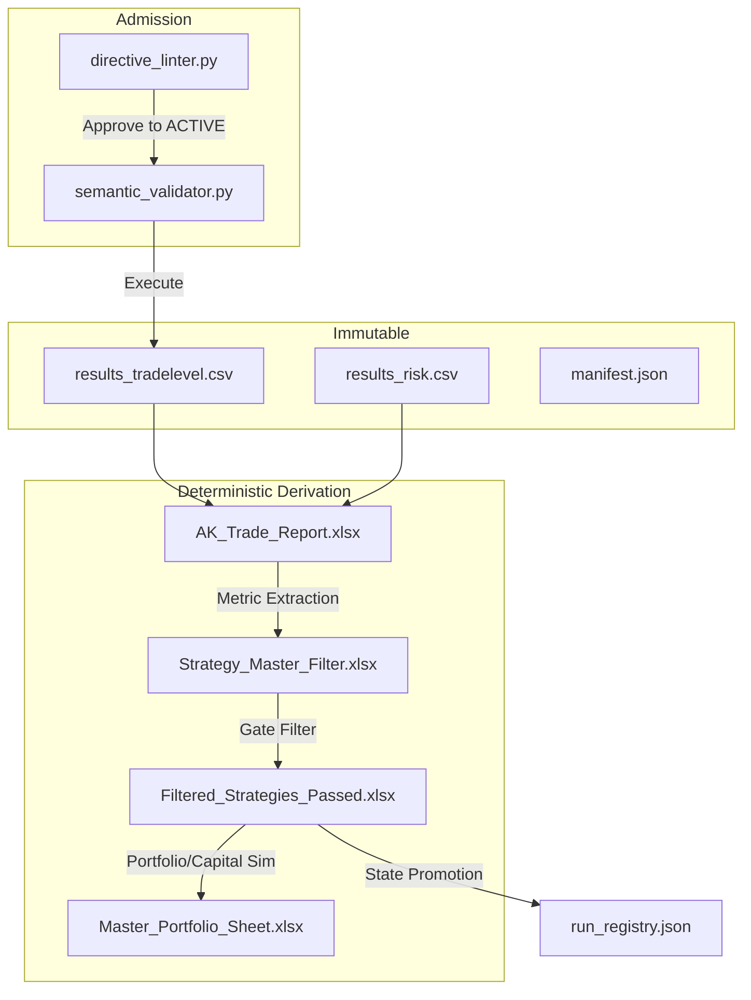

# TradeScan Pipeline Integrity and Schema Report

**Status**: Stage-Wise Audit Complete
**Objective**: Comprehensive analysis of pipeline outputs, strict schema definitions, lineage validation, and invariant enforcement aligned with system architecture.

---

## 1. Stage Enumeration & Artifact Mapping

*Note: The primary artifact storage location is the external `TradeScan_State` directory, which maintains explicit physical boundaries from the execution logic (`Trade_Scan`). The `vault` directory stores versioned snapshots.*

| Stage | Name | Layer | Input Artifacts | Output Artifacts |
| :--- | :--- | :--- | :--- | :--- |
| **Stage 0** | Admission | Gov/Strategy | `directive_state.json`, INBOX YAML | `ACTIVE` YAML Directive, `run_registry.json` |
| **Stage 0.5**| Semantic Val | Gov | `ACTIVE` Directive | Pass/Fail AST Check |
| **Stage 1** | Execution | Engine/Auth | `strategy.py`, tick data | `TradeScan_State/runs/.../raw/results_tradelevel.csv`, `results_risk.csv` |
| **Stage 2** | Reporting | Computation | Stage-1 CSVs (`tradelevel`, `risk`, etc.) | `TradeScan_State/runs/.../AK_Trade_Report.xlsx` |
| **Stage 3** | Aggregation | Computation | `AK_Trade_Report.xlsx`, `results_tradelevel.csv` | `Strategy_Master_Filter.xlsx` |
| **Stage 3A**| Bound Manifest | Authority | Stage 1 standard artifacts | `manifest.json` |
| **Stage 4** | Candidate Promo | Computation | `Strategy_Master_Filter.xlsx`, `run_registry.json` | `TradeScan_State/candidates/` & `Filtered_Strategies_Passed.xlsx` |
| **Stage 5** | Capital Wrapper | Engine | Stage 3 Ledgers | `TradeScan_State/strategies/Master_Portfolio_Sheet.xlsx` (Post-eval) |
| **Post** | Formatting | Presentation| Output Excel ledgers | Formatted `.xlsx` |

---

## 2. Strict Schema Extraction

### A. `results_tradelevel.csv` (Authority Layer)
* **Primary Key**: `(strategy_name, parent_trade_id)`
* **Structure**: Trade-level granular execution log. Strict ordering of sequences.
* **Invariants**: Append-only execution record. `trend_label` must not be null/empty. `volatility_regime` strictly enforced integer strings.
* **Core Columns**: `strategy_name`, `parent_trade_id`, `sequence_index`, `entry_timestamp`, `exit_timestamp`, `direction`, `entry_price`, `exit_price`, `pnl_usd`, `r_multiple`, `trade_high`, `trade_low`, `bars_held`, `atr_entry`, `position_units`, `notional_usd`, `mfe_price`, `mae_price`, `mfe_r`, `mae_r`, `volatility_regime`, `trend_score`, `trend_regime`, `trend_label`, `symbol`, `initial_stop_price`, `risk_distance`, `market_regime`, `regime_id`, `regime_age`.

### B. `results_risk.csv` (Authority Layer)
* **Primary Key**: N/A (1 row per run)
* **Core Columns**: `max_drawdown_usd`, `max_drawdown_pct`, `return_dd_ratio`, `sharpe_ratio`, `sortino_ratio`, `k_ratio`, `sqn`.

### C. `AK_Trade_Report.xlsx` (Computation Layer - "Performance Summary")
* **Structure**: Transposed vertical metric listing.
* **Metric Columns**: `Metric`, `All Trades`, `Long Trades`, `Short Trades`.
* **Invariants**: Exclusively derived from `results_tradelevel.csv`. Exact label strings enforced (e.g. `Net Profit (USD)`).

### D. `Strategy_Master_Filter.xlsx` (Computation Layer)
* **Primary Key**: `run_id`
* **Structure**: Dense horizontal aggregation per strategy.
* **Metrics (Ordered strict schema)**: `run_id`, `strategy`, `symbol`, `timeframe`, `test_start`, `test_end`, `trading_period`, `total_trades`, `trade_density`, `total_net_profit`, `gross_profit`, `gross_loss`, `profit_factor`, `expectancy`, `sharpe_ratio`, `max_drawdown`, `max_dd_pct`, `return_dd_ratio`, `worst_5_loss_pct`, `longest_loss_streak`, `pct_time_in_market`, `avg_bars_in_trade`, `net_profit_high_vol`, `net_profit_normal_vol`, `net_profit_low_vol`, `net_profit_asia`, `net_profit_london`, `net_profit_ny`, `net_profit_strong_up`, `net_profit_weak_up`, `net_profit_neutral`, `net_profit_weak_down`, `net_profit_strong_down`, `trades_strong_up`, `trades_weak_up`, `trades_neutral`, `trades_weak_down`, `trades_strong_down`, `IN_PORTFOLIO`.
* **Invariants**: Inherits exact strings from Stage-2, dynamically computes missing trend logic from Stage-1. `IN_PORTFOLIO` defaults to `False`.

**Regime Aggregation Note:**
Regime information is provided ONLY as distributional metrics:
- `net_profit_*` (trend & volatility)
- `trades_*` (trend participation)

No dominant regime or classification exists in the pipeline.
Any such interpretation must be computed externally.

### E. `Master_Portfolio_Sheet.xlsx` (Computation/Capital Layer)
* **Primary Key**: `portfolio_id`
* **Structure**: Portfolio-level consolidated performance and capital allocation summary.
* **Metrics (Ordered strict schema)**: `portfolio_id`, `source_strategy`, `reference_capital_usd`, `trade_density`, `profile_trade_density`, `theoretical_pnl`, `realized_pnl`, `sharpe`, `max_dd_pct`, `return_dd_ratio`, `win_rate`, `profit_factor`, `expectancy`, `total_trades`, `exposure_pct`, `equity_stability_k_ratio`, `deployed_profile`, `realized_pnl_usd`, `trades_accepted`, `trades_rejected`, `rejection_rate_pct`, `realized_vs_theoretical_pnl`, `peak_capital_deployed`, `capital_overextension_ratio`, `avg_concurrent`, `max_concurrent`, `p95_concurrent`, `dd_max_concurrent`, `full_load_cluster`, `avg_pairwise_corr`, `max_pairwise_corr_stress`, `portfolio_net_profit_low_vol`, `portfolio_net_profit_normal_vol`, `portfolio_net_profit_high_vol`, `signal_timeframes`, `evaluation_timeframe`, `portfolio_engine_version`, `creation_timestamp`, `constituent_run_ids`, `rank`.
* **Column definitions**:
  * `trade_density`: Annualised trade count (total_trades / trading_period_years). Sourced from `Strategy_Master_Filter.xlsx` by summing constituent run densities.
  * `profile_trade_density`: Density after capital-wrapper rejection filtering — `trade_density × (1 − rejection_rate_pct / 100)`. Represents actual annual trade throughput under the deployed capital profile.
* **Invariants**: Evaluates promoted constituent runs. Overwrites realized constraints (capital wrappers/reconciliation) onto theoretical bounds without requiring a pipeline rerun.

### F. `Filtered_Strategies_Passed.xlsx` (Computation Layer)
* **Structure**: Identical 1:1 schema replication of `Strategy_Master_Filter.xlsx`.
* **Invariants**: Only contains rows meeting Stage 4 strict candidate gates (`total_trades >= 40`, `profit_factor >= 1.05`, `return_dd_ratio >= 0.6`, `expectancy >= 0.0`, `sharpe_ratio >= 0.3`, `max_dd_pct >= -80.0`).

### G. `manifest.json` (Authority Layer)
* **Structure**: Cryptographic binding of an execution sequence.
* **Keys**: `run_id`, `strategy_hash` (Strategy layer AST/File hash), `engine_version`, `artifacts` (dict of explicit Stage 1 outputs mapped to SHA-256), `timestamp`.
* **Invariants**: Run identity lock. Never modified post-Stage 3A.

### H. `run_registry.json` (Governance Layer)
* **Primary Key**: `run_id`
* **Schema**: `{ "run_id": str, "tier": enum("sandbox", "candidate"), "status": enum("invalid", "complete", "failed"), "created_at": iso_str, "directive_hash": str, "artifact_hash": str|null }`
* **Invariants**: Authoritative ledger for portfolio state lifecycle. Mutated sequentially.

---

## 3. Lineage Validation

**Observations:**
* **Mutation of Authority Layer**: Checked. Zero mutation paths found. Authority artifacts remain read-only post Stage 1.
* **Deterministic Reproduction**: `AK_Trade_Report.xlsx` accurately derives 100% of values programmatically from Stage-1. `Strategy_Master_Filter.xlsx` uses identical pandas extraction, making derived artifacts perfectly reproducible.

---

## 4. Cross-Stage Consistency & Drift Audit

### A. Split-Brain Extraction in Stage 3 (Resolved)
* *Previous Issue*: `stage3_compiler.py` primarily extracted values from `AK_Trade_Report.xlsx` (Stage 2), but bypassed Stage 2 to execute native aggregations for trend breakdown.
* *Current State*: **Resolved**. The trend computation logic has been correctly decoupled and migrated to `stage2_compiler.py`, restoring strict hierarchical layer derivation (Stage 1 -> Stage 2 -> Stage 3). Stage 3 now safely fetches these metrics without duplicating computation logic.

### B. Field Propagation Dependencies
* **Required Propagation**: `max_dd_pct` must successfully compute in Stage 2 and extract in Stage 3, otherwise `filter_strategies.py` (Stage 4) fatally aborts.
* **Rigid Labels (Resolved)**:
  * *Previous Issue*: Stage 3 mapping leveraged hardcoded string values (`"Max Drawdown (%)"`), meaning any modification to Stage 2's strings would break the pipeline.
  * *Current State*: **Resolved**. Stage 3 now utilizes a `_LABEL_TO_CANONICAL` reverse mapping at load time. All downstream extraction operates exclusively on canonical metric keys rather than human-readable Excel labels, completely decoupling computation from presentation strings.

---

## 5. Invariant Enforcement 

| Invariant | Status | Evidence |
| :--- | :--- | :--- |
| **Determinism** | STRICT | All Stage 2 & 3 scripts utilize exact index mapping and strict pandas transformations devoid of pseudo-randomness. |
| **Immutability** | STRICT | Operations on `AK_Trade_Report`, `results_tradelevel`, and `manifest` are executed as READ buffers. Master filters use APPEND/CONCAT semantics without overwriting historical rows. |
| **Manifest Binding** | STRICT | `manifest.json` correctly locks all standard execution artifacts upon completion of Stage 3A. |
| **Schema Stability** | PASS | `MASTER_FILTER_COLUMNS` strictly enforces missing keys by injecting `None` and preserving an ordered subset. No unbounded schemas exist. |

---

## 6. Resolved Issues & Applied Fixes

1. **Stage 3 Trend Compute De-coupling (Completed)**:
   * *Previous Issue*: `stage3_compiler.py` contained native aggregations for `compute_trend_metrics()`.
   * *Resolution*: The `compute_trend_metrics` logic has been successfully moved to `stage2_compiler.py`. Trend metrics now correctly reside in `AK_Trade_Report.xlsx`, and Stage 3 fetches them securely via dictionary extraction, adhering to the layer hierarchy.

2. **Master Portfolio Sheet columns D & E historically unpopulated (Fixed 2026-03-19)**:
   * *Previous Issue*: `trade_density` (col D) and `profile_trade_density` (col E) were `None` for all existing rows. A bug in `portfolio_evaluator.py` prevented these from being written during Stage 5. All 22 historical rows were affected.
   * *Resolution*: Bug fixed in `portfolio_evaluator.py`. All 22 existing rows backfilled in-place using `migrate_trade_density.py` (D from Master Filter constituent run lookup) and a derived pass (E = D × (1 − rejection_rate_pct/100)). No pipeline re-runs required. New runs from 2026-03-19 forward populate both columns automatically.

---

## Appendix: Deterministic Categorical Regimes

The pipeline execution engine enforces strict categorical constraints on several fields to guarantee downstream aggregation consistency. These are computed strictly at the **trade-level** within `results_tradelevel.csv`. There is no per-run regime classification.

### 1. Market Regime (`market_regime`)
Represents the synthesized 3-axis state (Direction, Structure, Volatility).
* `trend_expansion`: High directional conviction, high structural persistence, high volatility.
* `trend_compression`: High directional conviction, high structural persistence, low volatility.
* `unstable_trend`: High directional conviction, but low structural persistence (choppy).
* `mean_reversion`: Low directional conviction, high persistence, negative autocorrelation (fading).
* `range_high_vol`: Low directional conviction, low persistence, high volatility (whipsaw).
* `range_low_vol`: Low directional conviction, low persistence, low volatility (chop).

### 2. Trend Label (`trend_label`) / Trend Regime (`trend_regime`)
Derived from a legacy 5-model consensus vote sum (`trend_score`):
* `strong_up` (Regime: `2`): Score $\ge$ 3
* `weak_up` (Regime: `1`): Score $\ge$ 1
* `neutral` (Regime: `0`): Score = 0
* `weak_down` (Regime: `-1`): Score $\ge$ -2
* `strong_down` (Regime: `-2`): Score $\le$ -3

### 3. Volatility Regime (`volatility_regime`)
* `low`: Historically compressed ATR percentile.
* `normal`: Average ATR percentile range.
* `high`: Historically elevated ATR percentile.
